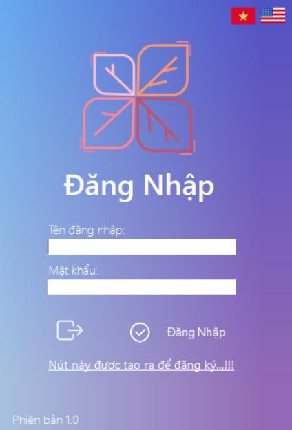

# Quản lí bán hàng-app
Phần mềm giúp người dùng quản lí công việc bán hàng một cách thuận lợi. 
---
#DISPLAY:

---

#LOGIN:

Login bao gồm: Tên đăng nhập và mật khẩu
* Người dùng nhập tên đăng nhập và mật khẩu để vô màn hình chính của chương trình.
*Người dùng cũng có thể tự tạo tài khoản bằng cách nhấp vào label "Đăng kí" phía dưới.

---

#HOMEPAGE:

Homepage là trang chính của phần mềm, chứa các chức năng chính bao gồm: Thêm, sửa, xóa, tìm, xem thông tin.

---

#KIẾN TRÚC PHẦN MỀM:

Mô hình 3-layer gồm có 3 phần chính :
* Presentation Layer (GUI) : Lớp này có nhiệm vụ chính giao tiếp với người dùng. Nó gồm
các thành phần giao diện ( win form, web form,…) và thực hiện các công việc như nhập liệu,
hiển thị dữ liêu, kiểm tra tính đúng đắn dữ liệu trước khi gọi lớp Business Logic Layer (BLL).
* Business Logic Layer (BLL) : Layer này phân ra 2 thành nhiệm vụ : Đây là nơi đáp ứng
các yêu cầu thao tác dữ liệu của GUI layer, xử lý chính nguồn dữ liệu từ Presentation Layer
trước khi truyền xuống Data Access Layer và lưu xuống hệ quản trị CSDL.
Đây còn là nơi kiểm tra các ràng buộc, tính toàn vẹn và hợp lệ dữ liệu, thực hiện tính toán và
xử lý các yêu cầu nghiệp vụ, trước khi trả kết quả về Presentation Layer.
* Data Access Layer (DAL) : Lớp này có chức năng giao tiếp với hệ quản trị CSDL như
thực hiện các công việc liên quan đến lưu trữ và truy vấn dữ liệu ( tìm kiếm, thêm, xóa, sửa,…).

---

#TECHNOLOGY:

C#:
*C# là một ngôn ngữ cấp cao và thuần hướng đối tượng, hỗ trợ rất mạnh trong việc xây dựng
các ứng dụng trên môi trường Windows. Đối với những lập trình viên đã từng sử dụng qua C,
C++, hoặc Java, việc nắm bắt và sử dụng C# một cách hiệu quả là khá dễ dàng và tốn ít thời
gian.
*Mã nguồn được viết bằng ngôn ngữ C# sẽ được dịch sang một ngôn ngữ tầm trung(
Intermediate Language) phù hợp với các đặc tả của Common Language Infrastructure (CLI), và
được lưu trữ trong các tập tin thực thi( thường có đuôi .exe hay .dll).

MySQL:
*MySQL là hệ quản trị cơ sở dữ liệu tự do nguồn mở phổ biến nhất thế giới và được các nhà
phát triển rất ưa chuộng trong quá trình phát triển ứng dụng. Vì MySQL là cơ sở dữ liệu tốc độ
cao, ổn định và dễ sử dụng, có tính khả chuyển, hoạt động trên nhiều hệ điều hành cung cấp
một hệ thống lớn các hàm tiện ích rất mạnh. Với tốc độ và tính bảo mật cao, MySQL rất thích
hợp cho các ứng dụng có truy cập CSDL trên internet. Người dùng có thể tải về MySQL miễn
phí từ trang chủ. MySQL có nhiều phiên bản cho các hệ điều hành khác nhau: phiên bản Win32
cho các hệ điều hành dòng Windows, Linux, Mac OS X, Unix, FreeBSD, NetBSD, Novell
NetWare, SGI Irix, Solaris, SunOS,.. MySQL là một trong những ví dụ rất cơ bản về Hệ Quản trị
Cơ sở dữ liệu quan hệ sử dụng Ngôn ngữ truy vấn có cấu trúc (SQL).

---

#NHÓM TÁC GIẢ:

*Thẩm Minh Đức
*Nguyễn Thành Đạt
*Đặng Ngọc Duy
*Nguyễn Thành Đạt

